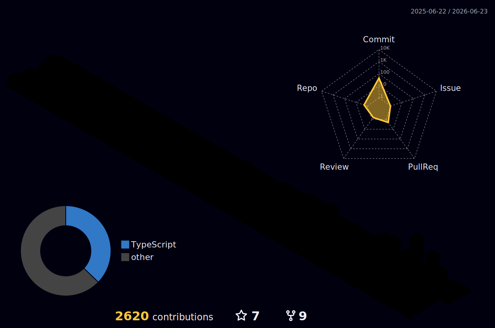

 

    <h1>Hi, I'm Zeeshan Ashraf 👋</h1>
  

  

 
 

### 👋 About

I'm a senior full-stack engineer with **8+ years** building production SaaS, AI, and cloud-heavy products. I work as a senior engineer and technical lead alongside startups and teams, taking **end-to-end ownership** — from backend architecture and APIs, through the frontend, down to AWS infrastructure, CI/CD, and the AI and automation layer on top. I care about systems that stay reliable well after launch, not just demos.

### 🛠️ What I do

- **Backend & APIs** — NestJS, Node.js, TypeScript, and PostgreSQL, designed to scale.
- **Cloud & DevOps** — AWS architecture, Docker, and CI/CD with deployments you can rely on. *(AWS Certified ×4: Solutions Architect, Developer, AI Practitioner, Cloud Practitioner.)*
- **AI products** — OpenAI and multi-LLM orchestration, OCR pipelines, and automation built into real products.
- **Full-stack delivery** — Next.js and React front ends wired cleanly to the systems behind them.

I work best where the hard problems live: scalable backends, real LLM integration, and AWS infrastructure that teams can build on.

## 🤝🏻 &nbsp;Let's connect

I'm open to senior full-stack, AWS, and AI engineering roles and projects. The best place to reach me is **[LinkedIn](https://www.linkedin.com/in/zeeshan-ashraf-dev/)**.

## Tech Stack

**Languages** 

**Backend** 

**Frontend** 

**Databases** 

**Cloud & DevOps** 

## 🤖 AI & Data

**LLM & Integration** 

**Voice & Speech** 

**Data Pipelines & Automation** 

## Holopin Board
	

|Stats />|Streak />|Languages />
|---|---|---|
||||

## ⚡️Github Contributions
	
<h4 align="center">Isometric view of contributions in the last year</h4>

	

## 🚀Github Metrics

	

	
## 🐛Github Magic Game

  

 

 
  Views 
  

